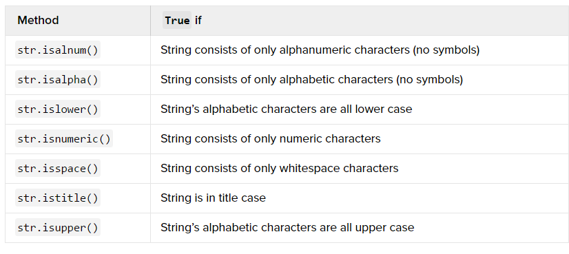

# Giới thiệu các hàm về chuỗi trong python

- Tham khảo

## Giới thiệu

- Python có một số hàm được dựng sẵn (built-in) dành cho kiểu dữ liệu là string.
- Trong bài viết này giới thiệu về một số hàm build-in đối với `string` trong python

## Tạo ra chuỗi có ký tự thường và ký tự hoa

- Hàm `str.upper()` sẽ cho kết quả trả về là chuỗi bao gồm các chữ cái viết hoa
- Hàm `str.lower()` sẽ cho kết quả trả về là chuỗi bao gồm các chữ cái viết thường
- Do `string` là kiểu dữ liệu không thay đổi được nên chuỗi sinh ra sẽ là một chuỗi mới.
- Những ký tự không phải là chữ cái sẽ không thay đổi được.

- Ví dụ dưới sẽ chuyển đổi dòng `Hoc Chu Dong 2017` thành chuỗi gồm các chữ cái viết hoa và số 2017
	```sh
	my_str = "Hoc Chu Dong 2017"
	print (my_str.upper())
	```

- Chuỗi mới sẽ là:
	```sh
	HOC CHU DONG 2017
	```

- Sử dụng hàm `lower()` với chuỗi trên thì kết quả đầu ra là chuỗi toàn ký tự viết thường, số 2017 sẽ được giữ nguyên.
	```sh
	my_str = "Hoc Chu Dong 2017"
	print (my_str.lower())
	```

- Kết quả là:
	```sh
	hoc chu dong 2017
	```

## Phương thức `Boolean` (Logic) trong `string`

- Python có phương thức làm việc với chuỗi để trả ra giá trị có kiểu `Boolean` (kiểu logic `True` - `False`)
- Phương thức này hữu ích khi sử dụng để tạo các form nhập từ người dùng. Ví dụ đối mã quốc gia thì bạn chỉ cho phép là các ký tự số, khi hỏi về tên người thì chỉ cho phép là các ký tự chữ.
- Dưới là bảng của các phương thức làm việc với chuỗi và trả về kết quả là `True` hoặc `Flase`



- Hãy thử ví dụ dưới dây trong IDLE trong windows hoặc Python CLI
	```sh
	so = "2017"
	chuoi = "hocchudong"

	print (so.isnumeric())
	print (chuoi.isnumeric())
	```

- Kết quả là
	```sh
	True
	False
	```

- Thử tiếp ví dụ dưới
	```sh
	tieu_de = "Hoc Chu Dong"

	print (tieu_de.istitle())
	``` 

	- Kết quả là:
		```sh
		True
		```
- Tiếp tục ví dụ dưới
	```sh
	chuoi1 = "hoc chu dong"
	print (chuoi1.islower())
	print (chuoi1.isupper())
	```

	- Kết quả là:
		```sh
		True
		False
		```

## Phương thức xác định độ dài của chuỗi `len()`

- Python cung cấp phương thức `len()` để xác định độ dài của chuỗi
- Ví dụ: Xác định độ dài của chuỗi dưới
	```sh
	my_str = "Hoc chu dong"
	print (len(my_str))
	```

- Kết quả là:
	```sh
	12
	```

- Trong ví dụ trên ta có 10 ký tự chữ cái và 2 khoảng trống, tổng là 12 ký tự tất cả.

## Phương thức `join(), split(), và replace()` trong chuỗi

### `join()`
- Phương thức `join()` sẽ ghép 2 chuỗi với nhau và chuyển thành một chuỗi khác.
- Ví dụ: ghép chuỗi `hocchudong` và chuỗi có ký tự trống `" "`
	```sh
	my_str = "hocchudong"
	print (" ".join(my_str))
	```

- Kết quả là ta sẽ có một chuỗi đơn, ký tự khoảng cách sẽ chèn vào giữa các ký tự của chuỗi:
	```sh
	h o c c h u d o n g
	```

- Ta cũng có thể phương thức `join()` để đảo ngược 1 chuỗi thành chuỗi mới, ví dụ:
	```sh
	my_str = "hoc chu dong"
	print ("".join(reversed(my_str)))
	```

- Kết quả là:
	```sh
	ngod uhc coh
	```

- Phương thức `str.join()` có tác dụng phối hợp list của một string thành một string đơn. 
- Ví dụ dưới sẽ khai báo list của một string và thực hiện chuyển nó thành một chuỗi đơn (hãy chú ý phần này để sử dụng trong các kỹ thuật ghép link)
	```sh
	my_list = ["hoc", "chu", "dong"]
	# In ra list
	print (my_list)

	# In ra chuoi sau khi su dung str.join()
	print (",".join(my_list))
	````

	- Kết quả là:
		```sh
		['hoc', 'chu', 'dong']
		hoc, chu, dong
		```

### `str.split()`

- Được sử dụng để cắt một `string` thành một `list`
- `str.split()` có đối số truyền vào là một ký tự, nếu không truyền vào thì nó sử dụng ký tự rỗng.
- Ví dụ: 
	```sh
	my_str = "hoc chu dong"
	print (my_str.split())
	```

	- Kết quả là:
		```sh
		['hoc', 'chu', 'dong']
		```

- Thay ký tự rỗng ở trên bằng ký tự `o` và quan sát kết quả
	```sh
	my_str = "hoc chu dong"
	print (my_str.split("o"))
	```

	- Kết quả là sẽ chia làm 03 phần  tử trong list dưới, ký tự `o` sẽ bị cắt đi.
	```
	['h', 'c chu d', 'ng']
	```