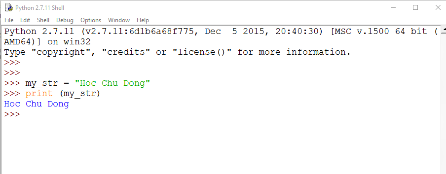
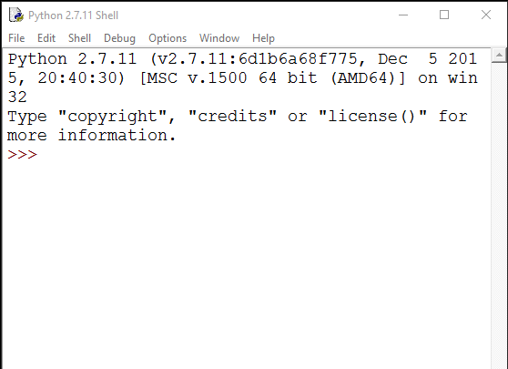

## Làm việc với chuỗi trong python3
- Chuỗi là một trong các kiểu dữ liệu phổ biến sử dụng trong Python
- Tham khảo: https://www.digitalocean.com/community/tutorials/an-introduction-to-working-with-strings-in-python-3

## Giới thiệu

- `String` - Chuỗi là sự kết hợp tuần của một hoặc nhiều ký tự (chữ cái, số, ký tự)
- String là kiểu dữ liệu không thay đổi (inmutable)
- Trong tài liệu này sẽ hướng dẫn bạn tạo, in, thao tác cơ bản với chuỗi.

## Tạo và in ra chuỗi (Strings)

- Chuỗ trong python được nằm trong cặp dấu nháy đơn `''` hoặc cặp dấu nháy kép `""`
- Ví dụ
	```sh
	"HOC CHU DONG"
	```

- Hoặc 
	```sh
	'HOC CHU DONG'
	```

- Nếu thực hiện trong IDLE (Windows) hoặc Python CLI (linux) thì sẽ có output như bên dưới
```sh
'HOC CHU DONG'
```

- Để in ra một chuỗi trong python ta làm như sau:
	```sh
	print ("Hoc Chu Dong")
	```

- hoặc
	```sh
	my_string = "Chu Dong Hoc"
	print (my_string)
	```

Kết quả là:
	```sh
	Chu Dong Hoc
	```

## Nối tiếp chuỗi

- Để nối tiếp chuỗi trong Python3, ta sử dụng phép cộng (`+`)
- Ví dụ dưới nối các chuỗi `HOC`, `CHU`, `DONG`
	```sh
	print ("HOC" + "CHU" + "DONG")
	```

- Kết quả là
	```sh
	HOCCHUDONG
	```

- Nếu muốn có các khoảng cách giữa các chuỗi, ta làm như sau
	```sh
	print ("HOC " + "CHU " + "DONG")
	```

- Chú ý về khoảng trống giữa các chuỗi, kết quả là:
	```sh
	HOC CHU DONG
	```

- Lưu ý: Khi thực hiện nối tiếp chuỗi cần chú ý kiểu của chuỗi phải phù hợp, ví dụ dưới sẽ gây ra lỗi bởi vì 2 chuỗi có kiểu khác nhau, một là `string` và một là `integer`, ví dụ:
	```sh
	print ("HOC CHU DONG" + 2017)
	```

- Kết quả là
	```sh
	>>> print ("HOC CHU DONG" + 2017)
	Traceback (most recent call last):
	  File "<stdin>", line 1, in <module>
	TypeError: must be str, not int
	```

- Nhưng nếu xử lý để đưa `2017` vào dấu nháy đơn hoặc nháy kép thì sẽ có kết quả đúng, bởi vì lúc đó `2017` sẽ là chuỗi, ví dụ:
	```sh
	print ("HOC CHU DONG " + "2017")
	```

- Kết quả là
	```sh
	HOC CHU DONG 2017
	```

## Lặp chuỗi 

- Sử dụng toán tử nhân `*` để lặp chuỗi cần thiết trong python3
- Số được nhân với chuỗi là một số nguyên dương.
- Ví dụ: lặp chuỗi HOCCHUDONG 3 lần
	```sh
	print ("HOCCHUDONG " * 3)
	```

- Kết quả là (chú ý dấu cách trong chuỗi)
	```sh
	HOCCHUDONG HOCCHUDONG HOCCHUDONG
	```

## Lưu trữ chuỗi trong các biến

- Biến - `Variables` là các các ký tự được sử dụng để lưu các giá trị - dữ liệu.
- Biến giống như các hộp rỗng để đựng các đồ vật.
- Để lưu chữ các chuỗi (`strings`) trong biến, ta sử dụng phép gán `=`. 
- Ví dụ dưới lưu trữ chuỗi bất kỳ trong biến `my_str`, chuỗi được bao đóng trong cặp dấu nháy đơn hoặc nháy kép.
	```sh
	my_str = "Hoc Chu Dong"

	print (my_str)
	```

- Kết quả
	```sh
	Hoc Chu Dong
```

- Khi lưu chuỗi vào biến như trên, ta có thể sử dụng lại chuỗi thông qua biến (Hãy sử dụng 2 câu lệnh `print` để in ra giá trị trong biến `my_str`)

## Bài tập

### Bài 1: Luyện tập với chuỗi ở chế độ IDLE hoăc CLI của Python

- Sử dụng IDLE python trong windows hoặc CLI python trong linux để thực hành các yêu cầu sau với chuỗi.
- Python CLI của 



- IDLE cuả WINDOWS



- Câu 1.1: Nhập vào CLI của Python dòng dưới và quan sát kết quả
	```sh
	"HOC CHU DONG"
	```

- Câu 1.2: Nhập vào CLI của Python dòng dưới và quan sát kết quả
	```sh
	HOC CHU DONG
	```

- Câu 1.3: Thực hiện gép 2 chuỗi dưới và quan sát kết quả
	```sh
	"HOC CHU " + "DONG"
	```

- Câu 1.4: Thực hiện ghép 2 chuỗi dưới và quan sát kết quả
	```sh
	"HOC CHU DONG " + 2017
	```

- Câu 1.4: Thực hiện ghép 2 chuỗi dưới và quan sát kết quả
	```sh
	"HOC CHU DONG " + "2017"
	```

- Câu 1.5: Thực hiện ghép 2 chuỗi dưới và quan sát kết quả
	```sh
	"HOC CHU DONG " + "2017"
	```

- Câu 1.6: Thực hiện lặp một chuỗi dưới và quan sát kết quả
	```sh
	"HOC CHU DONG " * 3 
	```

- Câu 1.7: Thực hiện các lệnh dưới và quan sát kết quả
	```sh
	my_str = "HOC CHU DONG"

	print (my_str)
	```

- Câu 1.8: Thực hiện các lệnh dưới và quan sát kết quả
	```sh
	my_str = "HOC CHU DONG"

	print (my_str * 2)

	print (my_str + "2017")
	```
